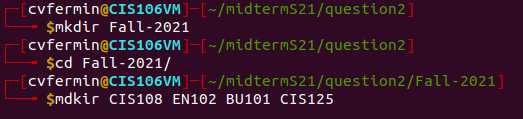
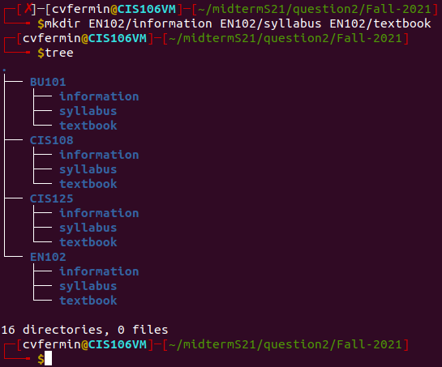
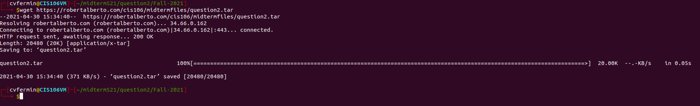
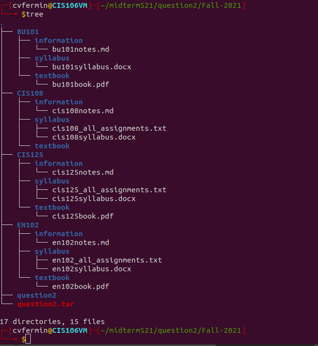
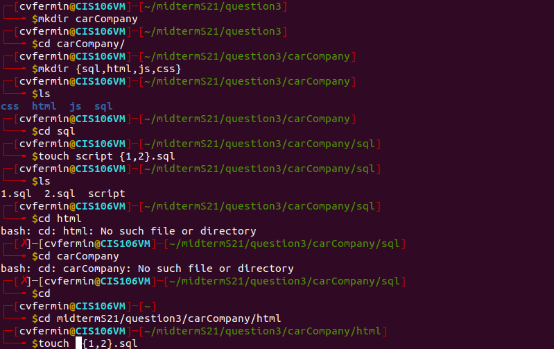
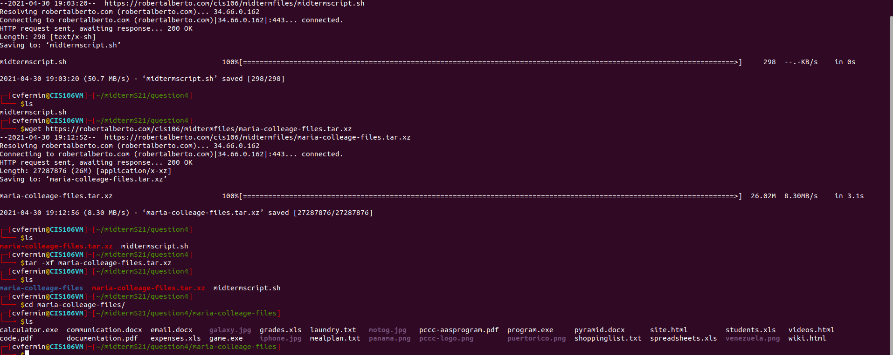

* Name: **Cristian V. Fermin**
*  Semester: **String 2019**

# Midterm Spring 2021
## Question 1
> Linux is completely free to use unlike Microsoft Windows or macOS. You don’t need to purchase any kind of licenses to use it for personal or commercial use. With a couple of hundred bucks saved, you can use it to upgrade your hardware, purchase premium services or anything better that you can think of. its "More Secure" meaning Linux is one of the most secure platforms when compared to macOS and Windows. Compatible with old and low-end hardware and it’s not that complicated to use. Drivers installed automatically also the ability to Customize the looks of your desktop as much you like is a good touch! así que el jefe de joseph, esta es la razón por la que Linux es una mejor opción que gastar miles de dólares en otra cosa.
## Question 2

## Question 3

## Question 4

## Question 5

## Question 6

## Question 7

## Question 8

## Question 9

## Question 10
- Which was the hardest question? Why?
>En mi honesta opinión profesor, after me studding for this midterm i still had a hard time doing this. i know you said not to freak out when seeing this test but im lying to you if i said i didn't. As soon as i started this midterm i kept on locking up in place. im am grateful for you extending the test but from me freezing in place made me lose time. im mad at myself for not completing it all but i did put my all. 
- Which was the easiest question? Why?
> set up,1,2,10,
- What could have made this midterm easier?
> this test still blew me off my feet even though i studied but im glad i went through it and tried my best at it. im not used to these type of test and was too used to the traditional testing.
- On a scale from 1 to 5 (1 meaning nothing at all and5 meaning a lot more than you thought), how much have you learned about Linux?
> a good 3.5
- In your opinion, do you think this format of the examination is better or worse than the traditional exams? A traditional exam is in the form of true or false questions and selects the right answer or short explanations.
>for me i have some issues with test taking like me freaking out, stressing something that was easy if i hadn't dwell on it or overthink it. for me i like the traditional way but this was a reality check for me because life cant always be easy, if it was then everyone would be miserable. pluse this is college not highschool and i got to accept that its not always going to be the way you want it to be. you need to adapt to new things in order to not be left behind.